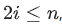

Задание взято с сайта с онлайн куурсами ([openedu.ru](https://courses.openedu.ru))

# Задние 1 "Стек" (4 неделя)

Реализуйте работу стека. Для каждой операции изъятия элемента выведите ее результат.

На вход программе подаются строки, содержащие команды. Каждая строка содержит одну команду. Команда — это либо "+ ", либо "−". Команда "+ " означает добавление в стек числа , по модулю не превышающего . Команда "−" означает изъятие элемента из стека. Гарантируется, что не происходит извлечения из пустого стека. Гарантируется, что размер стека в процессе выполнения команд не превысит  элементов.
__________________
если , то ;
если , то .
Дан массив целых чисел. Определите, является ли он неубывающей пирамидой.
__________________
Формат входного файла
Первая строка входного файла содержит целое число  (). Вторая строка содержит  целых чисел, по модулю не превосходящих .

Формат выходного файла
Выведите «YES», если массив является неубывающей пирамидой, и «NO» в противном случае.

