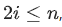

Структуру данных «куча», или, более конкретно, «неубывающая пирамида», можно реализовать на основе массива.

Для этого должно выполнятся основное свойство неубывающей пирамиды, которое заключается в том, что для каждого  выполняются условия:

если , то ;
если , то .
Дан массив целых чисел. Определите, является ли он неубывающей пирамидой.

Формат входного файла
Первая строка входного файла содержит целое число  (). Вторая строка содержит  целых чисел, по модулю не превосходящих .

Формат выходного файла
Выведите «YES», если массив является неубывающей пирамидой, и «NO» в противном случае.

